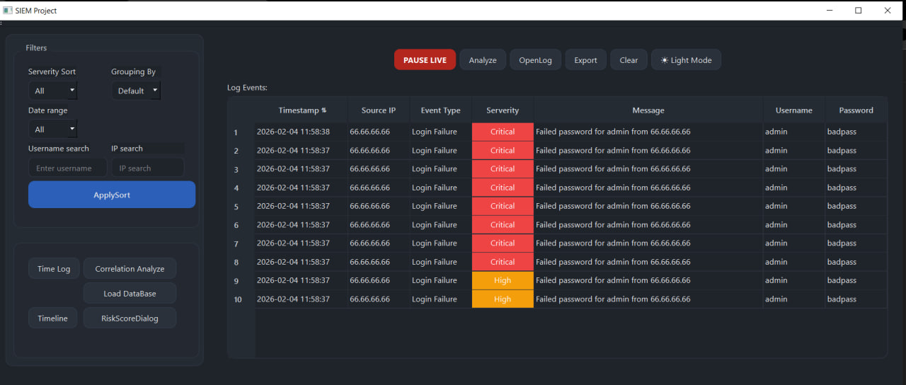
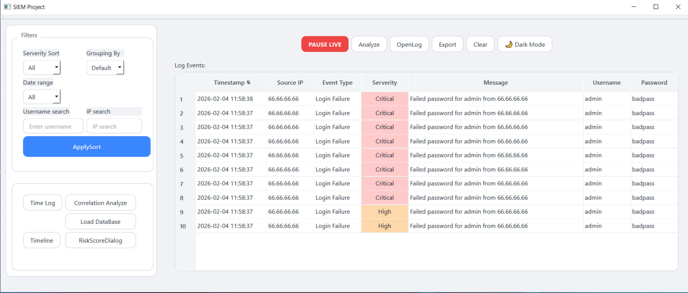
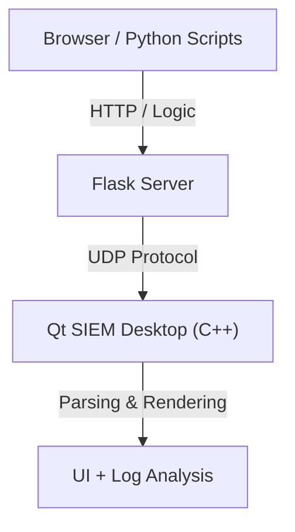

# 🛡️ SIEM Desktop Project (Qt/C++ + Python Demo)


**Lightweight Security Information and Event Management (SIEM)** – a desktop application built using **Qt (C++)**, integrated with external **Python-based log generators** and a **Flask demo login panel**.

This project demonstrates core security engineering concepts: log ingestion, real-time event visualization, and network attack simulation (Brute Force, DDoS).

---

## 📸 Screenshots

| 🌑 Dark Mode (Default) | ☀️ Light Mode (Clean & Flat) |
|:-------------------:|:-------------------------:|
|  |  |


---

## ✨ Features

### 🖥️ Desktop Application (Qt / C++)
* **Live Monitoring:** Real-time log table viewer via UDP socket listening.
* **Dynamic Visuals:** Row coloring based on event **Severity** (Critical/High/Medium) – logic handled natively in C++ for performance and theme compatibility.
* **Theme Engine:** Seamless switching between Dark Mode and Light Mode using custom QSS stylesheets.
* **Data Parsing:** Raw log parsing, timestamp sorting, and string manipulation.
* **UX/UI:** Advanced table filtering, status bar notifications, and responsive layout.

### 🌐 Python Demo Environment
A suite of tools to simulate real-world network traffic:
* **Flask Login Demo:** A web-based login interface that sends audit logs to the SIEM upon every success or failure.
* **Traffic Generators:** Scripts designed to simulate attacks:
    * 🔓 **Brute Force:** Simulates rapid password guessing attempts.
    * ⚡ **DDoS:** Simulates sudden bursts of high-volume traffic.
    * 🔗 **Correlation:** Generates logically related sequences of events.

---

## 🏗️ Architecture

Data flow overview:



Flow: Browser/Scripts -> Flask Server -> (UDP) -> Qt/C++ App -> Analysis


## 📁 Project Structure

```plaintext
SIEM-Project/
├── assets/
│   └── screenshots/              # Images for README
│
├── qss/                          # Stylesheets
│   ├── dark.qss
│   └── light.qss
│
├── sample_data/                  # Sample log data for testing
│
├── tools/                        # Simulation Environment
│   └── programs_for_testing_C++/ # Python scripts (Flask & Generators)
│
├── [Root Directory]              # Qt C++ Application Source Code
│   ├── main.cpp
│   ├── hellogui.cpp / .h / .ui
│   ├── udplistener.cpp / .h
│   ├── Analyze.cpp / .h
│   ├── AlertEngine.cpp / .h
│   └── ... (other source files)
│
├── LICENSE
└── README.md
```


🚀 Getting Started
1️⃣ Build Desktop Application
Requirements: Qt Framework (Widgets), C++ Compiler (MSVC or MinGW).

Open the project in Qt Creator or Visual Studio.

Configure and Build the project (Release or Debug).

Run the executable.

2️⃣ Run Flask Demo
Navigate to the web demo folder:

Bash
cd python/web_login_demo
pip install flask
python app.py
The server will start at: http://localhost:5555

3️⃣ Connect External Devices / VM
If testing from a Virtual Machine or another device on the LAN: Run Flask with the host parameter:

Python
# in app.py
app.run(host="0.0.0.0", port=5555)
⚠️ Firewall: Ensure UDP port 5555 is open for inbound traffic on the machine running the C++ app.


📡 Log Format
The application expects logs sent via UDP in a pipe-delimited format (|):

Plaintext
IP | EVENT | RESULT | USERNAME | HASH
Example Payload:

Plaintext
192.168.0.15 | LOGIN | FAILURE | admin | hash_bad_123
🧪 Testing Environment Notes
This project has been tested in the following environments:

Localhost (Loopback interface)

VirtualBox VM (Simulating an external attacker)

Mobile Network (Via Tethering)

⚠️ Troubleshooting:

Client shows Host IP instead of VM IP? If using VirtualBox in NAT mode, the IP might be translated by the host. Use Bridged Adapter mode in VirtualBox to allow the VM to appear as a distinct device on the LAN.

🧠 Learning Goals
This project was built for educational purposes, focusing on:

Networking Basics: Practical implementation of UDP sockets, HTTP servers, and handling NAT issues.

Log Pipelines: Building a full data pipeline (Ingestion -> Parsing -> Visualization).

Advanced Qt UI: Combining QSS stylesheets with native C++ painting (resolving conflicts between style sheets and logic-based row coloring).

Security Simulation: Understanding typical log patterns generated during network attacks.

📈 Future Improvements

[ ] JSON log format support.

[ ] Syslog integration.

[ ] Rule-based event correlation engine.

[ ] Database storage optimization (SQLite/MySQL).